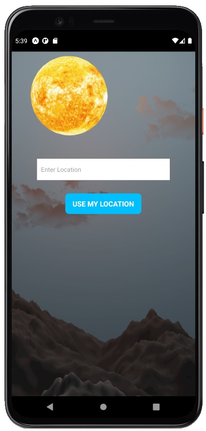
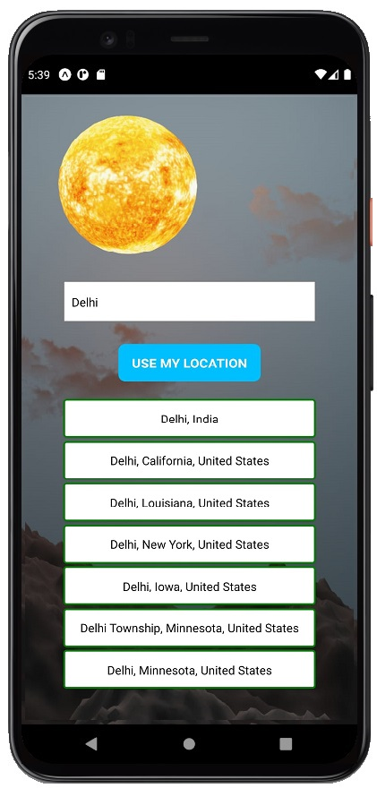
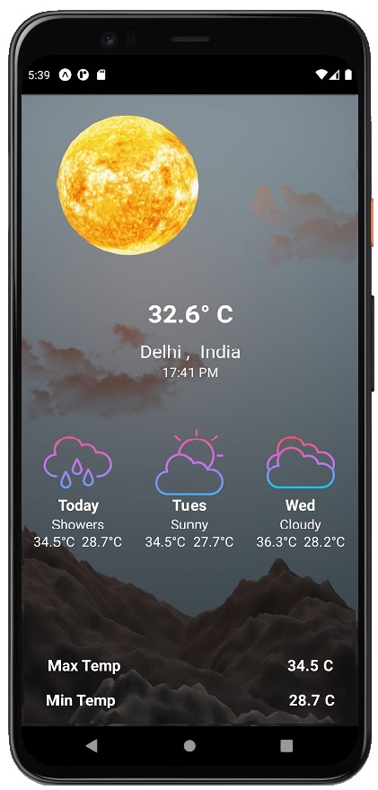
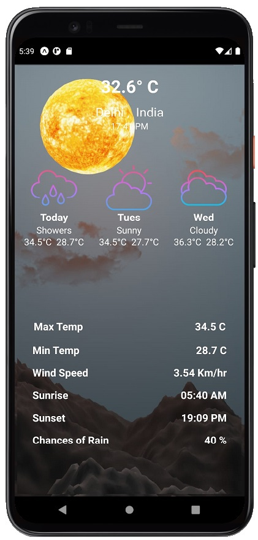

# WindHub
### Weatherapp is a simple weather forecast app, which uses some APIs to fetch 7 day forecast data  
### using React Native for both Android and IOS

App Screens
-------
| Home Page        | Searching Cities           | 
| ------------- | ---------:|
|      | |

| Weather Info        | Weather Info Cont.         | 
| ------------- | -----:|
|       |  |

## Goals and Features
It allows users to see conditions, forecast, temperature, and other related metrics of the device's  
current location,as well as a number of the other cities.

## Credits
api.weatherbit.io  
api.weather.com

## Contributors 🤝

<table>
  <tr>
    <td align="center">
            <a href="https://github.com/smgrv123">
               
              <b>Sumrit Grover</b>
            </a> 
            <a href="https://github.com/smgrv123">   
                🔥 🧠 ⛱
            </a>
          </td>
    <td align="center">
            <a href="https://github.com/pratyx">
               
              <b>Pratyusha Mandal</b>
            </a> 
            <a >
                📖
            </a>
          </td>
    <td align="center">
            <a href='https://github.com/hardik-kh'>
               
              <b>Hardik Khandelwal</b>
            </a> 
            <a >
                💻
            </a>
          </td>
  </tr>
</table>

## Download apk
You can run this app on your android phone by downloading from below  
<a href='https://drive.google.com/drive/folders/1SN1VXVqQeDce6yTjGyqdmpxIYocWT-I0'>
  CLICK HERE
  </a>
